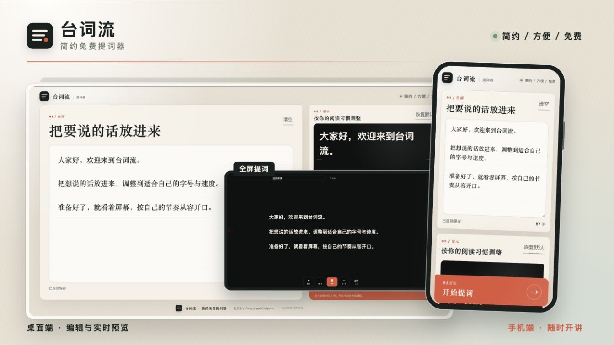

<p align="center">
  
</p>

# 台词流 · 简约免费提词器

台词流是一个由 AI 编写的简约、方便、免费的网页提词器，手机和电脑都能用。

它无需注册账号，打开即用，适合口播、短视频、演讲和录制等场景。

>  为妈妈下载提词器时发现 AppStore 里的免费的都不太好用，也不方便给其他人推荐分享，因此编写了这个。

### 🌈 演示

直接访问 [台词流](https://teleprompter.tyzhang.top/) 在线使用。



### 💡 功能

- 自动滚动，也可以手动拖动；手动拖动时自动暂停
- 自定义字号、行距、滚动速度、文字颜色和背景颜色
- 支持左对齐、居中、镜像显示和全屏提词
- 支持手机横竖屏和电脑使用
- 台词与设置自动保存在本机，添加到主屏幕后可离线使用

### 🔨 快速开始

1. 打开网站，粘贴或输入台词。
2. 按自己的习惯调整显示效果和滚动速度。
3. 点击“开始提词”，倒计时 3 秒后开始滚动；点击屏幕可以打开控制菜单。

想在本地开发修改或者运行，进入项目目录后执行：

```bash
python3 -m http.server 8080
```

然后访问 [http://localhost:8080](http://localhost:8080)。

### 🎤 其他

- 这是一个纯静态网页，不需要注册账号。台词仅保存在当前浏览器，清理网站数据后会被删除。
- 手机浏览器可以通过“添加到主屏幕”安装，首次加载后可离线使用。
- 有问题或建议，欢迎提交 [Issue](https://github.com/ztygalaxy/Teleprompter/issues)，也可以[邮件联系我](mailto:zhangty1996@163.com)。

如果觉得好用，欢迎给我一颗 Star。
