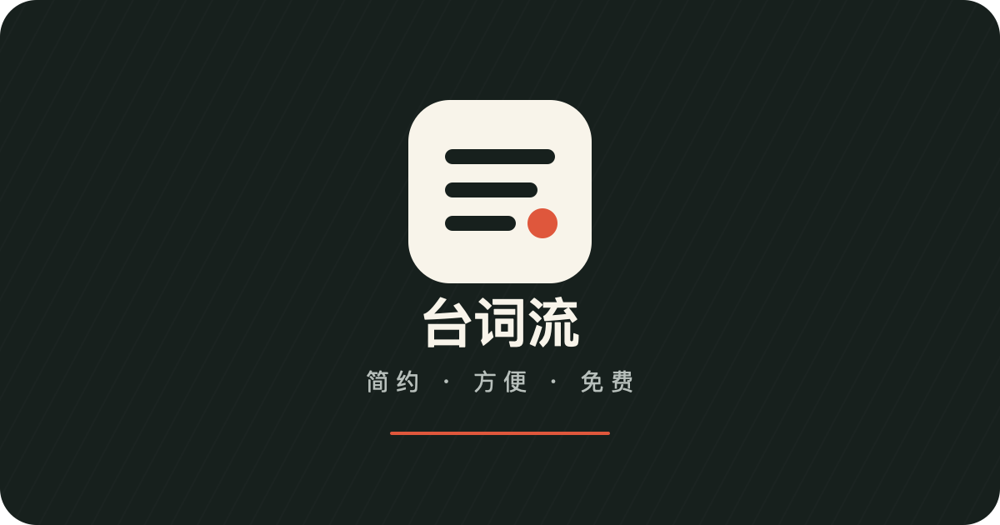

<div align="center">
  
  <h1>台词流 · 简约免费提词器</h1>
  <p>简约、方便、免费。无需登录，打开即用。</p>
  <p>
    <a href="https://teleprompter.tyzhang.top/">在线使用</a> ·
    <a href="#主要功能">主要功能</a> ·
    <a href="#本地运行">本地运行</a>
  </p>
</div>



> 作者：张天宇  
> GitHub：[@ztygalaxy](https://github.com/ztygalaxy)  
> E-mail：[zhangty1996@163.com](mailto:zhangty1996@163.com)

## 项目介绍

台词流是一款面向手机优先设计的网页提词器，适合口播、短视频、演讲和录制等场景。它不需要注册账号，也没有后端服务，台词和显示设置仅保存在当前浏览器中。

访问地址：[https://teleprompter.tyzhang.top/](https://teleprompter.tyzhang.top/)

## 主要功能

- 自动滚动与手动滚动，手动拖动时自动暂停
- 字号、行距、滚动速度、文字颜色和背景颜色可调
- 支持左对齐、居中和镜像显示
- 进入提词前 3 秒倒计时，支持播放、暂停和重新开始
- 手机横屏、竖屏及桌面端自适应
- 台词与设置自动保存在本机
- 支持 PWA，可添加到手机主屏幕并在首次加载后离线使用
- 支持屏幕常亮（取决于浏览器能力）

## 使用方法

1. 打开在线地址，将台词粘贴或输入到编辑区。
2. 根据阅读习惯调整字号、行距、颜色、对齐方式和滚动速度。
3. 点击“开始提词”，倒计时结束后自动滚动。
4. 提词过程中点击屏幕可显示控制菜单；手动拖动内容会暂停滚动。

手机浏览器可通过“添加到主屏幕”安装台词流，安装后的应用名称为“台词流”。

## 本地运行

本项目是纯静态网页，不需要安装依赖。在项目目录运行：

```bash
python3 -m http.server 8080
```

然后访问 [http://localhost:8080](http://localhost:8080)。同一局域网内的手机也可以通过电脑的局域网 IP 访问。

也可以直接打开 `index.html`，但通过本地服务器访问时，PWA 和离线缓存功能会更完整。

## 项目结构

```text
Teleprompter/
├── index.html
├── css/
│   └── style.css
├── js/
│   └── app.js
├── icons/
├── manifest.webmanifest
└── service-worker.js
```

## 隐私说明

台词内容仅保存在当前设备的浏览器本地存储中，不会上传到服务器。清理浏览器网站数据后，本地保存的台词和设置也会被删除。

## 反馈

如果在使用过程中发现问题或有功能建议，欢迎提交 [Issue](https://github.com/ztygalaxy/Teleprompter/issues)，也可以发送邮件至 [zhangty1996@163.com](mailto:zhangty1996@163.com)。

如果这个项目对你有帮助，欢迎点一个 Star。
